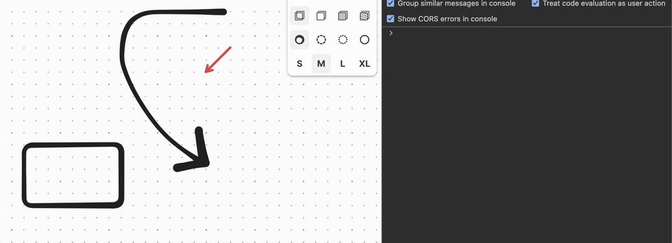
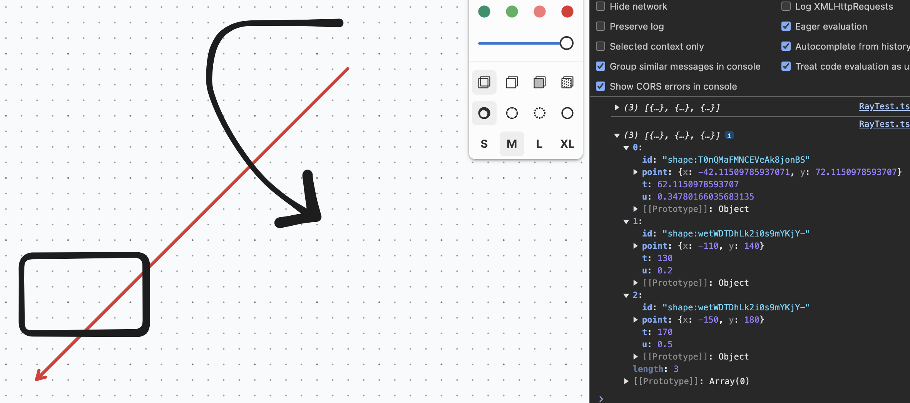

+++
date = '2025-01-19T15:00:00+00:00'
layout = 'post'
title = 'Raycast In tldraw'
image = './tldraw-ray-step.gif'
+++

For one of my tldraw projects I've been working on, I need to be able to know if
something is under a shape. As someone who dabbles in game development,
naturally I wanted to reach for a raycast so I could send out a ray and see if
any shapes intersected with it. I looked in the tldraw docs and it doesn't seem
like functionality that exists in the base API, which makes sense because tldraw
is not a game engine. So I figure I create it myself, how hard could it be?
Let's find out.

## Attempt 1: Stepping With a Ray

My first idea was to use an old fashioned raycast. We start with a ray origin,
direction, and an amount that represents how far the ray should check for hits.

Since we're using Typescript, let's create a couple types first to help us out.
The ray origin and direction is a vector so let's define the
five-hundredth-million vector type ever created.

```ts
type Vec2 = {
	x: number;
	y: number;
};
```

Then, when we do get an a hit with the raycast, we want to return an
intersection in the form of the id of the shape that was hit and the point that
the shape was hit at.

```ts
type Intersection = {
	id: string;
	point: Vec2;
};
```

Okay, now we can start. Let's create a reusable function for this. I'll put the
function definition and then we can go over the parameters.

```ts
const raycastStep = (
	editor: Editor,
	rayOrigin: Vec2,
	rayDir: Vec2,
	rayLength: number,
	step: number
): Intersection[] => {};
```

-   `editor` - Is a reference to the tldraw editor instance. We need this to get
    the shapes on the page and to check if there's hits with the ray.

-   `rayOrigin` - The (x, y) position of where the ray starts on the canvas.

-   `rayDir` - The direction that the ray should go in. For example, a direction
    of (-1, 1) will mean that the ray goes in the negative x direction (left)
    and positive in the y direction (which is down in tldraw since y increases
    going down).

-   `rayLength` - The amount that the ray should extend to before stopping.

-   `step` - The amount to move in between iterations. Every iteration the ray
    will extend by this amount. A lower value will give more precise results
    since there's more checks at the cost of performance and time. A higher
    value will be faster but the ray might step over a shape and not count the
    intersection. This works very well if you have consistent spacing between
    shapes but that's rarely the case with a typical usage of tldraw.

Ok let's get into writing the function. Since we want the hits that occur when
we send the ray, we get the current shapes on the page. We could do this every
step of the ray but then the shapes might have changed between steps which could
be what you want but we won't cover that here.

```ts
const shapes = editor.getCurrentPageShapes();
```

Next, we need to keep track of the current position of the ray. As the ray
steps, we update this position and use it to check for hits with shapes at that
position. At the beginning, the current position is the same as the origin.

```ts
const rayCurrentPos: Vec2 = { x: rayOrigin.x, y: rayOrigin.y };
```

Now we need to know how much to step in each direction. We have the overall step
amount but since x and y are separate, we have to multiply the direction by the
step.

```ts
const stepCalc = {
	x: rayDir.x * step,
	y: rayDir.y * step,
};
```

We also have to keep track of the current length of the ray so that we know when
we have reached the ray length and we should stop checking for hits.

```ts
let rayLengthCurrent = 0;
```

The last thing before we get to the stepping loop is to keep track of the shapes
we've intersected with the ray.

```ts
let intersections: Intersection[] = [];
```

Ok now onto the loop. In the loop, we'll:

-   Update the ray's current position (`rayCurrentPos`) by the amount to step in
    each direction (`stepCalc`).

-   Check for intersections at the ray's current position and update the
    `intersections` if any were found.

-   Update the current length of the ray for the next iteration's check.

We want to keep stepping while the current length of the ray
(`rayLengthCurrent`) is smaller than the length of the ray passed in the
parameters (`rayLength`).

```ts
while (rayLengthCurrent < rayLength) {}
```

Inside of this loop, let's do the first step, updating the ray's current
position by the step amount. This is simply just adding the step in each
direction to the corresponding direction of the ray's current position.

```ts
rayCurrentPos.x += stepCalc.x;
rayCurrentPos.y += stepCalc.y;
```

Now to check for intersections. tldraw has a really handy utility function for
this, `getShapesAtPoint`. This function takes an (x, y) point and optional
parameters for whether we want to check for hits inside of a shape and a margin
to have some give or take to the calculation.

```ts
const shapesAtPoint = editor
	.getShapesAtPoint(
		{
			x: rayCurrentPos.x,
			y: rayCurrentPos.y,
		},
		{
			hitInside: true,
			margin: 10,
		}
	)
	.filter((shape) => intersections.every((i) => i.id !== shape.id));
```

Here we check for shapes at the current point of the ray. We set `hitInside` to
`true` because if the ray is inside of a shape we want to count that as a hit.
We also provide a `margin` because stepping can be so inaccurate, especially
with shapes like drawn lines and arrows. This will give some false results so in
a real scenario you would probably have a smaller amount for the `margin`.

We also need to filter out the shapes with ids that have already been added to
the `intersections` array because while the ray is near or in a shape, it will
keep returning that shape at that point.

Next, update the `intersections` array with the new ones we found, if any.

```ts
intersections = [
	...intersections,
	...shapesAtPoint.map((shape) => ({
		id: shape.id,
		point: { x: rayCurrentPos.x, y: rayCurrentPos.y },
	})),
];
```

`shapesAtPoint` returns the shapes but we don't need all that data, just the id
of the shape so we just save that along with the point of intersection, which is
the current position of the ray.

At the end of the loop we want to update the current length of the ray so that
the next iteration can know whether it has to keep going or end due to the ray
reaching its maximum length. We can calculate this by getting the ray's
magnitude with `length = sqrt(x^2 + y^2)`.

```ts
rayLengthCurrent += Math.sqrt(stepCalc.x ** 2 + stepCalc.y ** 2);
```

At the end of the function, outside the `while` loop, we can return any
intersections that were found.

```ts
return intersections;
```

Let's use this!

```ts
const rayOrigin = { x: 20, y: 10 };

const rayDir = { x: -1, y: 1 };

const rayLength = 300;

const intersections = raycastStep(editor, rayOrigin, rayDir, rayLength, 10);
```

Here we create a ray starting at (20, 10) and going in a downward-left direction
on the canvas until it reaches a length of 300, checking for hits every 10
pixels. Remember that we also passed a margin of 10 in `getShapesAtPoint` so
hopefully this should get most intersections.

Here is an example of it working, showing how the ray steps as an array shape.



This method is cool, and fun to watch in debug mode, but it's not very
efficient. We have to step, which could miss some shapes, and we have to wait
for the ray to finish stepping, when we really already know the positions of
every shape on the page and we should be able to do an instant check. This
brings us to the second method, a parametric ray-segment intersection check
where we check the edge of every shape against the path of the ray to see where
we have hits. This can give us more accurate results, especially for line based
shapes.

## Attempt 2: Ray-Segment Intersection

This function is going to have the same function signature as the stepping
version, however, it's going to have a different return value. In addition to
the id of the shape and the point of intersection, we'll also be able to
determine how far along the ray that the intersection occured and how far along
the edge that the intersection is. You might not need the data but it's still
fun to have.

Let's define the type for this return value.

```ts
type IntersectionRaySegment = {
	id: string;
	point: Vec2;
	/**
	 * How far along the ray (0 at the origin or x units away) the
	 * intersection is.
	 */
	t: number;
	/**
	 * How far along the segment (0 at the start, 1 at the end) the
	 * intersection is.
	 */
	u: number;
};
```

So our function signature looks like this.

```ts
const raycastRaySegment = (
	editor: Editor,
	rayOrigin: Vec2,
	rayDir: Vec2,
	rayLength: number
): IntersectionRaySegment[] => {};
```

Just like before, let's first get all of the shapes on the page.

```ts
const shapes = editor.getCurrentPageShapes();
```

Also again we need to keep track of the intersections that we found.

```ts
let intersections: IntersectionRaySegment[] = [];
```

Since we're not stepping and just performing a single check, we don't need to
keep track of current position or ray length. We'll be checking along the entire
length of the ray in one calculation.

Next, since we're working on edges, we need to loop through each shape.

```ts
shapes.forEach((shape) => {});
```

**Note:** We go through the edges so that we can have more accurate results,
like where exactly we hit on a geo shape, but also consider a drawn line that
starts from behind the ray and moves in front of it. To accurately get an
intersection on this type of line, we have to split it up so that we know what
parts are in front of the ray.

Ok so inside of this `forEach` loop, we need to create the edges that we're
going to check the ray against.

tldraw has a very handy function to help with this called `getShapeGeometry`.
This returns useful data about a shape like it's bounding box but also it's
vertices, which are the points that make up the shape.

```ts
const geometry = editor.getShapeGeometry(shape.id);
if (!geometry) return;
```

**Note:** `getShapeGeometry`'s return doesn't include `undefined` but I ran into
an issue where I got `cannot read properties of undefined` when trying to read
the vertices so I added the check for `undefined` in.

Now, we have the vertices under `geometry.vertices`. Again we'll loop through
these to create the edges to check against.

```ts
geometry.vertices.forEach((vertex, i) => {});
```

Before we create an edge, we have to make a check first. If we're on the last
vertex for this shape, and the shape is not a closed shape, then we want to
return early. A closed shape is a shape like a rectangle or circle while a not
closed shape is a drawn line, arrow, etc. If the shape is closed, then we want
to connect the last vertex to the first one to form the last edge. In a drawn
line, we don't want to connect the last vertex to the first one because it would
close the line.

```ts
if (!geometry.isClosed && i === geometry.vertices.length - 1) {
	return;
}
```

Now that we know we have another edge to create still, let's get the end point
of the edge. This is the next vertex, or the first vertex if we're at the end of
the vertices for a closed shape.

```ts
const nextVertex = geometry.vertices[(i + 1) % geometry.vertices.length];
```

Now we can make our edge, which spans from the current vertex to the next
vertex. Let's define a type for the edge next to our other types and then back
in the loop, we create the edge.

```ts
type Edge = {
	start: Vec2;
	end: Vec2;
};
```

```ts
const edge: Edge = {
	start: { x: shape.x + vertex.x, y: shape.y + vertex.y },
	end: {
		x: shape.x + nextVertex.x,
		y: shape.y + nextVertex.y,
	},
};
```

Now that we have the edge to check the ray against, we should filter out edges
that aren't in the direction of the ray. There's likely to be a lot of these
since most shapes will be outside the bounds of the ray so we want to avoid
these intersection checks that we know will fail. To do this, we can use dot
product culling.

To do this, we need to substract the start and end vectors from the origin of
the ray which gives us the direction from the start of the ray to the edge
start/end and then we take the dot product to determine whether that direction
is in front of or behind the direction of the ray.

Let's define the functions to functions to subtract two vectors and to take the
dot product of a vector.

```ts
const sub = (vec1: Vec2, vec2: Vec2): Vec2 => {
	return { x: vec1.x - vec2.x, y: vec1.y - vec2.y };
};

const dot = (vec1: Vec2, vec2: Vec2): number => {
	return vec1.x * vec2.x + vec1.y * vec1.y;
};
```

Now we can use these to get the start and end dot products.

```ts
const dotStart = dot(sub(edge.start, rayOrigin), rayDir);
const dotEnd = dot(sub(edge.end, rayOrigin), rayDir);
```

If the dot product of either the start or end of the edge is lower than 0, then
it means that the edge is behind the ray and we don't need to check it so we can
return early.

```ts
if (dotStart < 0 && dotEnd < 0) {
	return;
}
```

At this point, we know we need to check this edge because it's in the general
vicinity of the ray. Let's create the segment to check against by getting the
direction of the edge. This tells us how we move from the start of the edge to
the end.

```ts
const segment = sub(edge.end, edge.start);
```

Next, we need to get the delta vector, which is how we move from the start of
the edge to the ray's origin.

```ts
const delta = sub(rayOrigin, edge.start);
```

Next, we have another check to eliminate whether we should keep checking this
segment or not. We want to know if the segment is parallel to the ray or not. To
do this, we have to calculate the determinant. The formula for the determinant
is `det = a.x * b.y - a.y * b.x` so to use it, with our inverse y, we have.

```ts
const det = segment.x * -rayDir.y - segment.y * -rayDir.x;
```

Checking for a parallel line can be a bit tricky because we can consider it
parallel if it's very close to zero instead of exactly zero. To do this check,
we take the absolute value of the determinant and check if it's smaller than a
number very close to zero. This number is arbitrary and any small number can
work but a popular one is `1e-12`.

```ts
if (Math.abs(det) < 1e-12) {
	return;
}
```

Now we know that the lines are not parallel so we can continue checking. Here we
can solve for `u` and `t` in our intersection return value.

-   `u` - Tells us where along the segment `edge.start` -> `edge.end` the ray
    intersects. This is a percentage of the point along the line. For example,
    if we intersect the middle of the segment, the `u` value will be 0.5.

-   `t` - Tells us where along the ray `rayOrigin` -> `rayOrigin + rayDirection`
    we intersect. Or at what point along the ray it intersects the shape.

This formula comes from rearranging
`rayOrigin + t * rayDir = edge.start + u * segment` which is a linear equation
used to solve the intersection of a ray and a segment. This is a known equation
so we won't go into the details here but there's plenty of resources online that
explain this much better than I could.

```ts
const u = (-delta.x * rayDir.y + delta.y * rayDir.x) / det;
const t = (segment.x * delta.y - segment.y * delta.x) / det;
```

A couple more checks here. First, since the line segment is from the start to
the end, `u` needs to be a value between 0 and 1. If it's outside of these
values, then it means the intersection point is not actually on the segment so
we can return early.

```ts
if (u < 0 || u > 1) {
	return;
}
```

Next, we only consider intersections in front of teh ray and within the length
of the ray. Now since we did the dot product culling earlier all intersections
should be in front of the ray but we might as well check anyways since we have
the exact value now.

```ts
if (t < 0 || t > rayLength) {
	return;
}
```

If both of these checks pass, we have an intersection! The point of intersection
is the start of the edge, plus the amount along the edge that the intersection
occurs at multiplied by the segment, which scales the length of the segment by
the percentage point where the intersection occured.

```ts
const intersect: Vec2 = {
	x: edge.start.x + u * segment.x,
	y: edge.start.y + u * segment.y,
};
```

Then we save it to the intersections to return.

```ts
intersections = [
	...intersections,
	{
		id: shape.id,
		point: intersect,
		t,
		u,
	},
];
```

Lastly, like the other function, outside of the loop we return the
intersections.

```ts
return intersections;
```

Let's use this with the same ray as last time.

```ts
const rayOrigin = { x: 20, y: 10 };

const rayDir = { x: -1, y: 1 };

const rayLength = 300;

const intersections = raycastRaySegment(editor, rayOrigin, rayDir, rayLength);
```

This looks like:



You'll notice that we get multiple intersections for the same shape. You can
filter these out like before but with the precise intersection information
returned, it could be useful so I keep it around and just filter it out myself
when I use the results.

In the end, this is probably the better solution but there's still
inefficiencies to checking every shape and its vertices. There's still some
optimizations to be made that we can maybe explore in a future post.

The source code for this post can be found on
[GitHub](https://github.com/robertcorponoi/tldraw-raycast).
