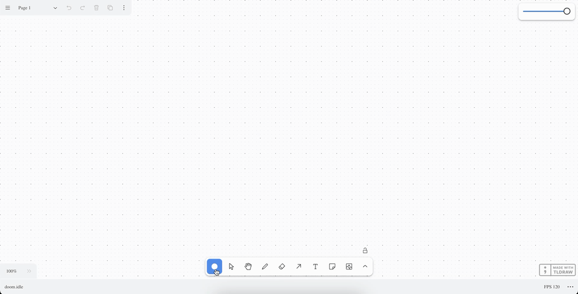

+++
date = '2025-01-12T00:00:00+00:00'
layout = 'post'
title = 'Tldraw - Can It Run Doom (Shapes)?'
image = './tldoom-shapes-short.gif'
+++

Ok so we did this before at [Tldraw - Can It Run Doom?](./posts/tldoom) but we
cheated a bit, we just compiled for WebAssembly and placed the canvas Emscripten
created on the tldraw canvas.

But now let's do it for real. Can tldraw run Doom, but with tldraw shapes to
render the game's pixels.

So we're going to have the same setup as the last post. We're starting with the
changes we made to SDL-Doom to get it to compile and Emscripten installed. I'll
only be going over the things that are different between that post and this one.

The source code for this post can be found on
[GitHub](https://github.com/robertcorponoi/tldoom-shapes)

## Getting The Frame Buffer

So in order to know what to render to display the game, we need a way to be able
to get the frame buffer. From there we can get an array of all of the RGB colors
in the current frame of the game.

We'll add this to `d_main.c` since it's the entry point of the game.

The first thing we need is the color palette for the game, so that we can map
the screen buffer to the RGB colors used in the game. To do this, we create a
global variable to store the color palette used in the game. The palette is
stored in the WAD, in a lump named "PLAYPAL". So let's define this variable and
populate it with the palette data.

First, we have to include the `w_wad.h` header, since that is where the game
data is:

```c
#include "w_wad.h"
```

Then, define our palette as a global variable and define the function that
retrieves it from the game assets.

```c
EMSCRIPTEN_KEEPALIVE
uint8_t* palette;

EMSCRIPTEN_KEEPALIVE
void InitPalette() {
    palette = W_CacheLumpName("PLAYPAL", PU_CACHE);
}
```

Next, in `D_DoomLoop`, we call `InitPalette()` to populate the data:

```c
InitPalette();

I_InitGraphics ();
```

**Note:** `EMSCRIPTEN_KEEPALIVE` tells the compiler and linker to preserve and
export our code.

Now we can create the global variable to hold our RGB buffer data nd the
function that maps the screen buffer to the palette.

For each pixel in the game, we'll get it's index in the screen buffer, and use
that index to match it to the palette.

```c
EMSCRIPTEN_KEEPALIVE
uint8_t* getFrameBuffer(void) {
    size_t bufferSize = SCREENWIDTH * SCREENHEIGHT * 3;

    for (int y = 0; y < SCREENHEIGHT; y++) {
        for (int x = 0; x < SCREENWIDTH; x++) {
            int index = y * SCREENWIDTH + x;

            uint8_t paletteIndex = screens[0][index];
            rgbBuffer[index * 3 + 0] = palette[paletteIndex * 3 + 0];
            rgbBuffer[index * 3 + 1] = palette[paletteIndex * 3 + 1];
            rgbBuffer[index * 3 + 2] = palette[paletteIndex * 3 + 2];
        }
    }

    return rgbBuffer;
}
```

The `bufferSize` is the size of the game, but times 3 because there's 3 values
for each RGB color.

Since we're looping through the width and height, we use
`int index = y * SCREENWIDTH + x` to map the 2D coordinate into a 1D index,
since `screens[0]` has a flat structure.

That's all the changes we need to make to the source code.

Before we can use it in the frontend though, we need to modify our build script
to export this function. In our `build.sh` script, modify the line containing
the flags to pass to Emscripten.

```sh
export EMCC_CFLAGS="-std=c99 -sUSE_SDL -sEXPORTED_FUNCTIONS=_main,_getFrameBuffer -sEXPORTED_RUNTIME_METHODS=ccall,cwrap"
```

Here we declare our `_getFrameBuffer` as an exported function (along with
`_main`, I'm not sure why we need it but the compiler complains if we don't also
export it). We also export the runtime method `cwrap`, which lets us call the
function from our frontend.

Run this script and let's move on to the next part.

## Typescript Updates

We have to make a couple changes to our `globals.d.ts` for new additions to the
`Module` object. If you don't care about Typescript, feel free to skip this
part.

After `preRun`, in `globals.d.ts`, add the following:

```ts
{
    // preRun...
    onRuntimeInitialized: () => void;
    HEAPU8?: Uint8Array;
    cwrap?: (
        fnName: string,
        returnType: string,
        paramTypes: unknown[]
    ) => (...args: unknown[]) => unknown;
}
```

The `onRunTimeInitialized` is called when the game is ready to run. We need to
know when this happens because we can't get the frame buffer before then.

`HEAPU8` is a reference to the entire WASM memory. We'll be getting our RGB
buffer from here.

`cwrap` is the function provided by Emscripten that is used to get a pointer to
our `getFrameBuffer` function.

Now we can get into the frontend part!

## Removing Resizing

So we're going to reuse the `TLDoom` shape from the last post.

Outside of the shape definition, we're going to define a couple constants.

```ts
const GAME_WIDTH = 320;
const GAME_HEIGHT = 200;
```

We'll need to reference this multiple times so we'll define them here and set
them to the base size of the game.

I'm not going to try resizing in this post. In fact, I've removed resizing
utilities from the last one. I return `false` from `canResize`, removed the
`onResize` override, and removed the `isAspectRatioLocked` override.

## Updating Module

Let's start in our `useEffect` where we set up `window.Module`. We keep the
`preRun`, but we're going to change the `canvas`. We don't need the canvas
anymore but I can't figure out how to not have it. If we don't pass something,
the generated JS fails because it needs to be able to attach event listeners to
the canvas.

But let's try to trick this. In the `component`, outside of the `useEffect`, add
a ref for an `OffscreenCanvas`.

```ts
const offscreenCanvasRef = useRef<OffscreenCanvas>(
	new OffscreenCanvas(GAME_WIDTH, GAME_HEIGHT)
);
```

Then, in `window.Module.canvas`, we return:

```ts
canvas: (() => {
    return offscreenCanvasRef.current as unknown as HTMLCanvasElement;
})(),
```

At this point you can also remove the ref to the old canvas and the canvas
element itself from the JSX.

and it seems to work. The script runs and no canvas is rendered to the screen.

Next, we need to define `onRuntimeInitialized`. This is where we know that the
RGB buffer is ready to be read.

You could add the tldraw code here, but I like to keep my `useEffect`s smaller
if possible so I added a state for `isReady`:

```ts
const [isReady, setIsReady] = useState<boolean>(false);
```

and then for `window.Module.onRuntimeInitialized`, I simply have:

```ts
onRuntimeInitialized: () => {
	setIsReady(true);
},
```

## Setting Up The UseEffect

At this point, we're ready to create the `useEffect` that draws the game to the
tldraw canvas.

The base of this `useEffect` looks like:

```ts
useEffect(() => {}, [shape.id, isReady]);
```

We need `shape.id` so we can get our custom shape for it's position and
`isReady` will be the first check we make within it.

```ts
if (!isReady) {
	return;
}
```

Simply put if we're not ready to get the buffer, return early.

Next, let's get our custom shape that was created since we'll need its position
to determine the position of our pixels.

```ts
const doomShape = this.editor.getShape(shape.id);
if (!doomShape) {
	return;
}
```

## Target Pixel Count

Before we go further, we need to talk about something I learned in retrospect. I
was going to cover this after this implementation failed but it's a pretty big
aspect of it so I'll get into it now.

Our goal for this is to render pixels as shapes. If we created a shape for each
pixel, this would be 64,000 shapes, which just kills my browser tab.

But of course we're not giving up here. What we'll do instead is target a lower
pixel count. This is configurable and for this post, we'll aim for 8,000 pixels
which manages to render and be playable for me. What this means though, is that
we'll lose a lot of detail. We're going to have to group pixels together and
display them as one. I think this is acceptable though, as long as we get the
game to actually run.

Let's define our target as 8,000, which I found was good enough to kind of play
and could run.

```ts
const targetPixels = 8000;
```

Using this value, let's calculate the number of blocks per row and column and
the size of blocks.

We divide `GAME_WIDTH / GAME_HEIGHT` to make sure we maintain the aspect ratio
of the game.

We then take the square root to make sure we evenly distribute the blocks across
the width.

```ts
const blocksPerRow = Math.sqrt(targetPixels * (GAME_WIDTH / GAME_HEIGHT));
```

Then, for blocks per column, we divide the target pixels by blocks per row:

```ts
const blocksPerColumn = targetPixels / blocksPerRow;
```

Now if we do this for 8,000 pixels, it will look like:

-   Blocks per row = sqrt(8000 \* (320 / 200)) = ~113
-   Blocks per column = 8000 / 113 = ~71

Multiplying these together gives us 8023, which is more than 8000 but close
enough.

For the block width and height, we just divide the game width or height by
blocks per row or blocks per column, respectively.

```ts
const blockWidth = Math.ceil(GAME_WIDTH / blocksPerRow);
const blockHeight = Math.ceil(GAME_HEIGHT / blocksPerColumn);
```

Also, by default tldraw has a cap of 4,000 shapes per page so we need to update
that. In `App.tsx` where we initialize the `Tldraw` component, update the
options:

```ts
options={{
    maxShapesPerPage: 65000,
}}
```

## The Color Palette

We have have another issue, the color palette. We can only create shapes with
colors that are in the tldraw color palette. These colors are black, grey,
light-violet, voilet, blue, light-blue, yellow, orange, green, light-green,
light-red, and red. We can customize the colors behind these values but we have
to provide one of these values.

The problem is that the Doom color palette, isn't going to match the tldraw
color palette. To get around this problem, we're going to need to map RGB colors
from the Doom color palette to the nearest tldraw color.

I'm sure there's a better way to do this but I inspected all of the RGB values
in tldraw's color palette and created an array of the RGB values and color names
that we can reference.

```ts
const tldrawColorPalette = [
	{ r: 29, g: 29, b: 29, color: "black" },
	{ r: 159, g: 168, b: 178, color: "grey" },
	{ r: 224, g: 133, b: 244, color: "light-violet" },
	{ r: 174, g: 62, b: 201, color: "violet" },
	{ r: 68, g: 101, b: 233, color: "blue" },
	{ r: 75, g: 161, b: 241, color: "light-blue" },
	{ r: 241, g: 172, b: 75, color: "yellow" },
	{ r: 225, g: 105, b: 25, color: "orange" },
	{ r: 9, g: 146, b: 104, color: "green" },
	{ r: 76, g: 176, b: 94, color: "light-green" },
	{ r: 248, g: 119, b: 119, color: "light-red" },
	{ r: 224, g: 49, b: 49, color: "red" },
];
```

Next, we need a function that, given a RGB color, returns the closest tldraw
color to it.

This function is going to go through each color in the tldraw palette and
calculate the Euclidean distance between the RGB color and the tldraw color. The
closest distance is chosen as the color.

```ts
const findClosestTldrawPaletteColor = (
	r: number,
	g: number,
	b: number
): TLDefaultColorStyle => {
	let closestColor = tldrawColorPalette[0].color;
	let minDistance = Infinity;

	for (const { r: pr, g: pg, b: pb, color } of tldrawColorPalette) {
		const distance =
			Math.pow(r - pr, 2) + Math.pow(g - pg, 2) + Math.pow(b - pb, 2);

		if (distance < minDistance) {
			minDistance = distance;
			closestColor = color;
		}
	}

	return closestColor as TLDefaultColorStyle;
};
```

**Note:** We don't need the full Euclidean distance, the square root, because
we're only comparing distances and not the actual distance.

## Creating The Pixel Shapes

At this point, we can create our initial pixel shapes. We're going to loop
through the blocks of pixels to create, define the shapes, and add them to an
array that we'll then call `editor.createShapes` on to batch create them.

We don't need to calculate colors here, we'll do that in our game loop.

First, let's create the array that will hold our shapes. As mentioned before we
add them all here so we can batch create them.

```ts
const pixels: TLShape[] = [];
```

Now, for each block, we define the partial for it and add it to the `pixels`
array. We define its position as the position of our custom shape plus the
offset of the block with the width and height of the block size.

```ts
for (let by = 0; by < GAME_HEIGHT; by += blockHeight) {
	for (let bx = 0; bx < GAME_WIDTH; bx += blockWidth) {
		const pixel: Partial<TLGeoShape> = {
			type: "geo",
			id: createShapeId(),
			x: doomShape.x + bx,
			y: doomShape.y + by,
			props: {
				geo: "rectangle",
				size: "m",
				color: "black",
				dash: "solid",
				w: blockWidth,
				h: blockHeight,
			},
		};

		pixels.push(pixel);
	}
}
```

Now that we've populated the array with all of the pixel shapes to create,
create them all at once.

```ts
this.editor.createShapes(pixels);
```

We're almost there, we just need the game loop to update the colors of the pixel
shapes each frame.

## Updating The Pixel Shapes

Here is where we'll define our game loop.

```ts
const gameLoop = () => {};
```

Here is where we'll use `window.Module.cwrap` to get our `getFrameBuffer`
function:

```ts
const getFrameBuffer = window.Module.cwrap!("getFrameBuffer", "number", []);
```

The first parameter is the name of the function, the second parameter is what it
returns (`number` for the pointer to the frame buffer), and the third parameter
is any arguments to pass to it, which we have none.

Now we can call it to the the location of our frame buffer in the WASM memory.

```ts
const frameBufferPointer = getFrameBuffer() as number;
```

Now we can get the actual RGB buffer from this. `frameBufferPointer` is the
pointer to where in the WASM memory (`HEAPU8`) our RGB buffer is.

```ts
const rgbBuffer = new Uint8Array(
	window.Module.HEAPU8!.buffer,
	frameBufferPointer,
	GAME_WIDTH * GAME_HEIGHT * 3
);
```

The last parameter is the size of the buffer, which is the number of pixels in
the game times 3 for RGB.

Just like when we created the shapes, we'll want to batch update them so we
define an array to push the updates to:

```ts
const toUpdate = [];
```

We also need to define an index outside of the loop to keep track of which
tldraw shape we are updating. We can't use the loop variable because it doesn't
increment by 1 each loop.

```ts
let index = 0;
```

Now for the update. For each block, we find where the color for it is in the RGB
buffer, get the RGB values, find the nearest tldraw color for this RGB value,
and then update the color of the shape to that nearest tldraw color.

```ts
for (let by = 0; by < GAME_HEIGHT; by += blockHeight) {
	for (let bx = 0; bx < GAME_WIDTH; bx += blockWidth) {
		const pixelIndex = (Math.floor(by) * GAME_WIDTH + Math.floor(bx)) * 3;

		if (pixelIndex >= rgbBuffer.length) break;

		const r = rgbBuffer[pixelIndex + 0];
		const g = rgbBuffer[pixelIndex + 1];
		const b = rgbBuffer[pixelIndex + 2];

		const color = findClosestTldrawPaletteColor(r, g, b);

		const update = {
			id: pixels[index].id,
			type: "geo",
			props: {
				color: color,
			},
		};
		toUpdate.push(update);

		index++;
	}
}
```

**Note:** Colors should probably be cached.

Now that we've queued our updates, let's run a batch update.

```ts
this.editor.updateShapes(toUpdate);
```

Finally, request another frame to keep the loop going.

```ts
requestAnimationFrame(gameLoop);
```

Outside of this function, we want to call it to begin the game loop.

```ts
gameLoop();
```

To finish things up, let's clean up our `useEffect` by deleting all shapes when
the component is unmounted.

```ts
return () => {
	this.editor.deleteShapes(pixels.map((pixel) => pixel.id));
};
```

If you run the app and place the custom shape, you should (after some loading
time) be able to play the game! There's limited pixels so you'll need to know
what you're doing in the menu but it's playable. You can hover over the game and
see that it's entirely composed of shapes.



## What's Next

Aside from some of the same things mentioned in the first post,

-   Improve performance.
-   Moving the custom shape doesn't move the game.
-   Be able to resize the game.
-   Change tldraw colors to be more closely in line with the Doom color palette.
-   Cache RGB colors to tldraw colors.
