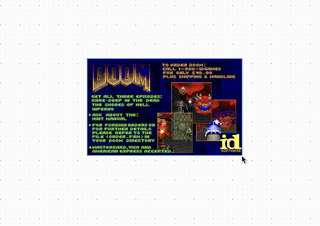
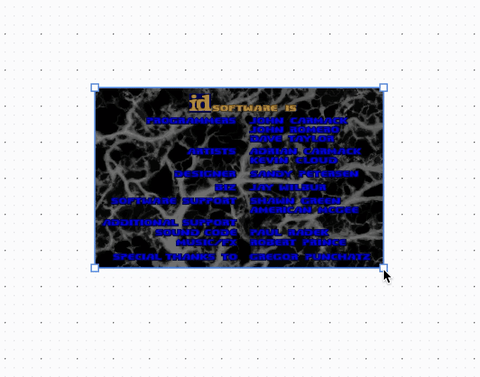

+++
date = '2024-12-30T15:23:25+08:00'
layout = 'post'
title = 'Tldraw - Can It Run Doom?'
image = './tldoom-playing-the-game.gif'
+++

Well yes, yes it can. I'm not even sure why I explored this but I did so I might
as well write about it.

After some brief research, it looked like compiling SDLDoom to WebAssembly was
going to be the best way to approach this. If you're unfamiliar with
[SDL](https://www.libsdl.org/), like I was at the beginning, it's a library for
low level access to audio, graphics, and input and it makes Doom easier to
compile and run on modern operating systems.

So from [libsdl's Doom project](https://www.libsdl.org/projects/doom/) I
downloaded the original port and the `doom1.wad` file. I had never heard of a
`wad` file before now but the best way I heard it explained is that
[it's like a zip file for Doom's assets](https://www.doomworld.com/forum/post/2044324).

I put the `sdldoom-1.10` source at the top level in my source code, on the same
level as the `package.json`. This isn't too important, you can place it where
you like but we do reference the path in other parts later so if you don't place
it in the same spot, you'll have to update other paths later.

As far as the `doom1.wad` file, it needs to be accessible in the browser so
where you place this depends on your application. For me, I'm using
[Vite](https://github.com/vitejs/vite) so I placed it in the `public` directory.
The generated WebAssembly will also need to be placed somewhere it can be served
so make sure you have the capability to serve static files.

## Emscripten

To compile to WebAssembly, we're going to use
[emscripten](https://emscripten.org/). It should be fairly simple to use it to
compile sdldoom to WebAssembly but we have to make some modifications to the C
source first.

The first few changes are not really noteworthy, just includes that we need with
emscripten so I'll just list them off.

**w_wad.c**

After the other includes, on line 44-ish, add:

```c
#ifdef __EMSCRIPTEN__
#include <alloca.h>
#endif
```

**r_data.c**

Before the `#include "m_swap.h"`, on line 38-ish, add:

```c
#ifdef __EMSCRIPTEN__
#include <alloca.h>
#endif
```

**i_sound.c**

After the `#include "SDL_audio.h"`, and `#include "SDL_mutex.h"`, it should look
like:

```c
#ifdef __EMSCRIPTEN__
#include "SDL_endian.h"
#else
#include "SDL_byteorder.h"
#endif
#include "SDL_version.h"
```

**i_net.c**

First, remove the following line:

```c
#error You should hack this file for your BSD sockets layer
```

Then, after the three `#endif`s, we need to add a block for emscripten, on line
58-ish.

```c
#ifdef __EMSCRIPTEN__
#include <sys/socket.h>
#include <netinet/in.h>
#include <arpa/inet.h>
#include <unistd.h>
#include <netdb.h>
#include <sys/ioctl.h>
#ifndef IPPORT_USERRESERVED
#define IPPORT_USERRESERVED	5000
#endif
```

**d_main.c**

This last one is a little more involved but first we have to add the emscripten
header, on lilne 91-ish, after `#include "d_main.h"`:

```c
#ifdef __EMSCRIPTEN__
#include "emscripten.h"
#endif
```

Now, since this is going to be running in the browser, we need to make an
adjustment to the game loop so that it uses `requestAnimationFrame` when
compiled by emscripten.

First, we need to pull the update logic out of the loop and into a separate
function because we'll need to run the logic in a couple places.

The logic that we'll need in this function is going to be copied directly from
the game loop of the `D_DoomLoop` function. So from that function, copy the
lines within the `while(1)` block, starting from `I_StartFrame ();` and ending
at `D_Display ();`.

Then, above the `D_DoomLoop` function, create a new function, with the signature
`void UpdateFrame (void)`, and paste the lines you copied as its body.

Lastly, replace the entire `while (1)` loop in the `D_DoomLoop` function with:

```c
#ifdef __EMSCRIPTEN__
    emscripten_set_main_loop(UpdateFrame, 0, true);
#else
while (1)
{
    UpdateFrame();
}
#endif
```

This will make sure that the loop works in the browser when compiled with
emscripten.

## Build Script

Ok, now that we have our source and the tools to be able to compile it, we need
to create a build script. The build script is going to run the emscripten
commands to build the C source and convert it to WebAssembly.

Let's see what this is going to look like. We create a file at the root, on the
same level as `package.json`, named `build.sh` and start off with

```sh
#!/bin/sh
```

to use the shell as an interpreter for the script.

Next, we have to change to the sdldoom directory that contains the source code
we want to build. If you remember from earlier, this is at the root of the
source code, at the same level as the build script so we can use

```sh
cd sdldoom-1.10
```

Next, we have to pass some flags to emscripten.

```sh
export EMCC_CFLAGS="-std=c89 -sUSE_SDL"
```

We use the C89 standard during compilation but more importantly, we tell
emscripten to use the SDL library since we're building sdldoom.

Next, we run emscripten's versions of `configure` and `make` to compile the C
source code.

```sh
emconfigure ./configure
emmake make
```

Now we're finally ready to compile it to WebAssembly.

```sh
emcc -o index.js ./*.o --preload-file ../public/doom1.wad@./ -s ALLOW_MEMORY_GROWTH=1
```

The generated javascript is to be output to a file named `index.js`. We also
have to pass in the path to the `doom1.wad` file, which is in our public
directory that I mentioned earlier. Then, we use `ALLOW_MEMORY_GROWTH=1` to
allow WebAssembly memory to dynamically grow during runtime.

**Note:** If the path passed to `--preload-file` is not in the same directory as
the source we're compiling, we have to specify it as `src@dst`. So our source is
in the `public` directory but we still want the output to be in the current
directory since we move the generated files next.

Lastly, we need to move the generated files to a place where they can be served
and accessed in the browser, which for me is the `public` directory.

```sh
mv index.* ../public
```

The files generated are named:

-   index.data
-   index.js
-   index.wasm

These all need to be served as they contain data about the game assets,
functionality, and how it interacts with the browser. If you have a chance, you
should read over the `index.js` as it handles setting up event listeners and
running the game loop.

Now you should try running the script. You'll probably have to give it
permission with `chmod 755 build.sh` but if you installed emscripten and its
dependencies correctly, it should run and generate the files mentioned above.

If you have issues with this, make sure you have the correct tools installed and
the modifications we made to the source code required to work with emscripten.

## The TLDoomShape

At first, I had wanted to see if I could just create a custom style in the style
panel that could be applied to any shape to turn it into Doom. From my research,
I couldn't find a way to do this without also creating a custom shape that knows
how to use that style so we'll just create a custom shape.

### Custom Shape Boilerplate

First, we have to create a type definition for our shape. This is just going to
be a minimal shape with a width and height, like so:

```tsx
type ITLDoomShape = TLBaseShape<
	"doom",
	{
		w: number;
		h: number;
	}
>;
```

Now let's create our shape with its basic properties.

```tsx
export class TLDoomShapeUtil extends ShapeUtil<ITLDoomShape> {
	static override type = "doom" as const;

	override canResize(): boolean {
		return true;
	}

	indicator(shape: ITLDoomShape): React.ReactElement {
		return <rect width={shape.props.w} height={shape.props.h} />;
	}

	getDefaultProps(): ITLDoomShape["props"] {
		return {
			w: 320,
			h: 200,
		};
	}

	getGeometry(shape: ITLDoomShape): Geometry2d {
		return new Rectangle2d({
			width: shape.props.w,
			height: shape.props.h,
			isFilled: true,
		});
	}

	component(shape: ITLDoomShape) {
		<HTMLContainer
			id={shape.id}
			style={{
				display: "flex",
				flexDirection: "column",
				alignItems: "center",
				justifyContent: "center",
				pointerEvents: "all",
			}}
		></HTMLContainer>;
	}
}
```

This is mostly just custom shape boilerplate but we'll go over each piece
briefly.

-   The `type` property should match the name of the shape in the type
    definition, so in our case it's `"doom"`.

-   The `canResize` override indicates that our shape is resizable. Resizing is
    an issue that we'll discuss later.

-   Thhe `indicator` method just returns the svg box used when the shape is
    hovered over or selected.

-   `getDefaultProps` returns the initial width and height of the shape.

-   `getGeometry` returns the shape's geometry for hit-testing, binding, and
    doing other geometric calculations.

-   The `component` is just like returning any other React functional component.
    We return a `HTMLContainer` which we'll add our game to later.

### Game Canvas

Next, we can add the `canvas` element that will render the game.

First, we'll create a `ref` for it, which we'll use to pass to the generated
JavaScript so it can attach event handlers and draw the game to it.

```tsx
const canvasRef = useRef<HTMLCanvasElement | null>(null);
```

Then, as a child of our `HTMLContainer`, add the canvas.

```tsx
<canvas
	id="canvas"
	ref={canvasRef}
	onContextMenu={(event) => event.preventDefault()}
	style={{
		backgroundColor: "black",
		imageRendering: "pixelated",
	}}
/>
```

While we have a ref to it, we also want to pass an id, so that we can access it
outside of the component context, as we'll see later.

Lastly, we have to let the game know about our canvas. The generated `index.js`
provides several globals on the `window` object but it also looks for an
important one if defined, `window.Module`. This can be thought of as a
configuration for the game. If it's not defined then it will be created by the
script but even if we define it, more properties get added to it when the game
is initialized. There's some
[documentation](https://emscripten.org/docs/api_reference/module.html#compilation-settings)
about the properties that can be passed to it but it doesn't seem like it has
every option, or if the full documentation is in another spot. If you have time
you should check out its properties when running the game to get more insight.

So, just to make sure this is only defined once when the custom shape is added,
we'll put it in a `useEffect`.

```tsx
useEffect(() => {
	window.Module = {
		preRun: [
			function () {
				window.SDL.defaults.copyOnLock = false;
			},
		],
		canvas: (function () {
			return canvasRef.current;
		})(),
	};
}, []);
```

Notice that it just returns the ref to our canvas. Also there's a `preRun`
property we also define but I pulled that from another example, I'm still not
sure what it does yet.

### Adding The Generated Script

The game is instantiated and runs from the `index.js` script that was generated
by emscripten. However, this doesn't play well with React. Our options are to
either add the script to the `index.html` that the React app is mounted to or to
dynamically add it to the DOM. We don't really want option 1 because there is a
chance the shape is never used so it would be a waste to always have it.

We're going to use a hook, `useScript`, that adds the script to the DOM and
removes it when the component unmounts. This hook is actually from
[useHooks](https://usehooks.com/usescript) with the
[source here](https://github.com/uidotdev/usehooks/blob/90fbbb4cc085e74e50c36a62a5759a40c62bb98e/index.js#L1097).

You can choose to add this package but I re-implemented it so it could be type
safe. If you want to check out the Typescript version, it's on this post's
[GitHub repo](https://github.com/robertcorponoi/tldoom/blob/main/src/useScript.ts).

Now, in our shape, below the `useEffect` that provides the `window.Module`
options, add the generated `index.js` using this hook like so:

```tsx
useScript("./index.js", { removeOnUnmount: true });
```

**Note:** Make sure you change the path to the `index.js` to suit your build
environment. Since I'm using Vite, everything in the `public` directory is
accessible at the root url so I can use `"./index.js"`.

We pass the `removeOnUnmount` so that when the shape is deleted, the script is
removed as well.

## New Game

The `TLDoomShape` is complete and we're almost ready to see it in action. We
just have to add it to the tldraw toolbar so it can be created.

First, we have to define the tool which determines which shape it creates.

```tsx
export class TLDoomShapeTool extends BaseBoxShapeTool {
	static override id = "doom";
	static override initial = "idle";
	override shapeType = "doom";
}
```

By default, the tool is not selected and when it is used, it creates a shape
with an id of `"doom"`, which is our custom shape.

Next, we have to add it to the tools, which contains the display definition of
the tool and what it does when it is clicked on.

```tsx
const uiOverrides: TLUiOverrides = {
	tools(editor, tools) {
		tools.doom = {
			id: "doom",
			icon: "color",
			label: "DOOM",
			kbd: "d",
			onSelect: () => {
				editor.setCurrentTool("doom");
			},
		};

		return tools;
	},
};
```

Now to add it to the toolbar so it is displayed alongside the other tools. This
is defined as a component override for the `Toolbar`. We create a menu item for
it and then render the default toolbar items after it.

```tsx
const components: TLComponents = {
	Toolbar: (props: DefaultToolbarProps) => {
		const tools = useTools();

		const isDoomSelected = useIsToolSelected(tools["doom"]);

		return (
			<DefaultToolbar {...props}>
				<TldrawUiMenuItem
					{...tools["doom"]}
					isSelected={isDoomSelected}
				/>
				<DefaultToolbarContent />
			</DefaultToolbar>
		);
	},
};
```

Then, add the tool and custom shape to constants that will be passed to the
`Tldraw` component.

```tsx
const customShapeUtils = [TLDoomShapeUtil];

const customTools = [TLDoomShapeTool];
```

Finally, when we initialize tldraw, we pass our custom shape, tool, and
components.

```tsx
<Tldraw
	shapeUtils={customShapeUtils}
	tools={customTools}
	overrides={uiOverrides}
	components={components}
/>
```

Now you should finally be able to click on the left most tool in the toolbar,
and click on the canvas to create an instance of the game. Using the arrow keys,
you can move around the menu (although if you don't click off the shape you'll
move the shape as well. I'll touch on this later but briefly since I don't have
a good answer for it yet).


## Resizing The Game

One of the nice things about making it a custom shape is that we can resize it
like any other shape and ideally, the game would re-render at the new
resolution. I wasn't able to get that to work, but I think it can, I just don't
know enough about either emscripten or SDL, whichever one is responsible for
resizing. Below I'll go over what I tried.

So we defined `canResize` as `true` earlier with:

```tsx
override canResize(): boolean {
    return true;
}
```



But this doesn't define what happens when it is resized so resizing currently
doesn't do anything. We need to override another method, `onResize` to define
this functionality.

The most basic functionality within this function is calling `tldraw`'s
`resizeBox` and returning that.

```tsx
override onResize(
    shape: ITLDoomShape,
    info: TLResizeInfo<ITLDoomShape>
): ITLDoomShape | undefined {
    const resized = resizeBox(shape, info);

    return resized;
}
```

I also locked the aspect ratio with another override. You don't have to do this
but I like keeping the aspect ratio locked, at least while develping.

```tsx
override isAspectRatioLocked(): boolean {
    return true;
}
```


But this still doesn't look like it's doing anything because we also need to
resize the canvas. Also, from what I see in the `./index.js` file, I notice a
function named `setCanvasSize` that will resize the canvas and I also see resize
event listeners added to the canvas so my thought process is that resizing the
canvas like this should update and re-draw the game at the new size.

```tsx
override onResize(
    shape: ITLDoomShape,
    info: TLResizeInfo<ITLDoomShape>
): ITLDoomShape | undefined {
    const canvas = document.getElementById("canvas");
    if (!canvas) return;

    const resized = resizeBox(shape, info);

    window.Browser.setCanvasSize(resized.props.w, resized.props.h);

    return resized;
}
```

**Note:** We have to use `document.getElementById` because this override is
outside of the React component so we can't use that ref we created for it.

If we try to resize now, you'll notice that the canvas resizes, but not the game
itself. If anyone has any ideas on how to fix this, I'd love to talk.



## Next Steps

If I wanted to continue with this, some other ideas I would pursue would be:

-   Actually have resize work.
-   Don't process click events for the custom shape when it's not selected. I
    initially tried this with `stopImmediatePropagation()` if the custom shape
    wasn't in the ids of the selected shapes but I had issues removing the event
    listeners when they were no longer needed.
-   Multiplayer? It would be cool to have a single instance controlled by all
    users.
