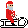
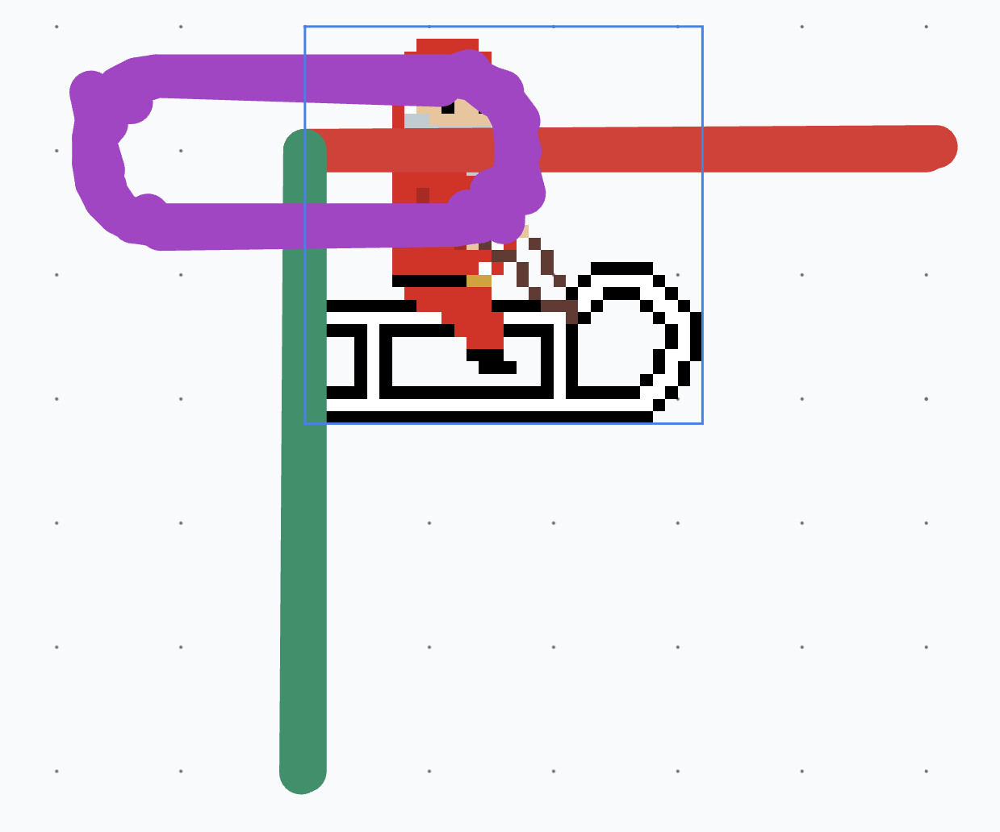
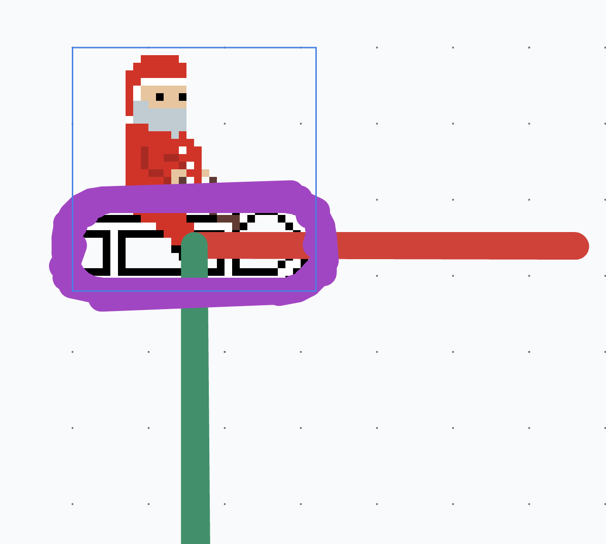
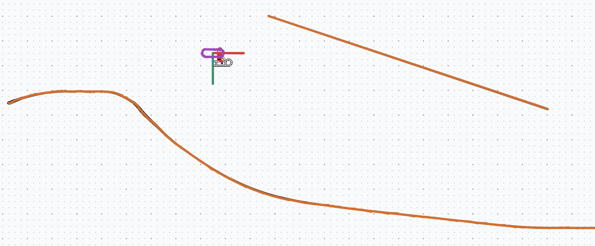
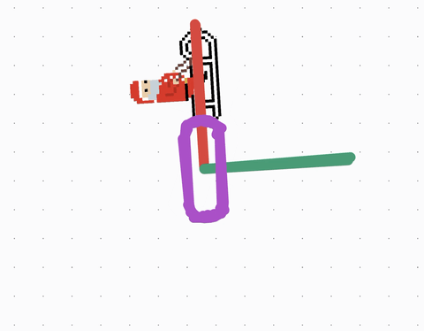
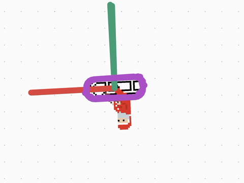
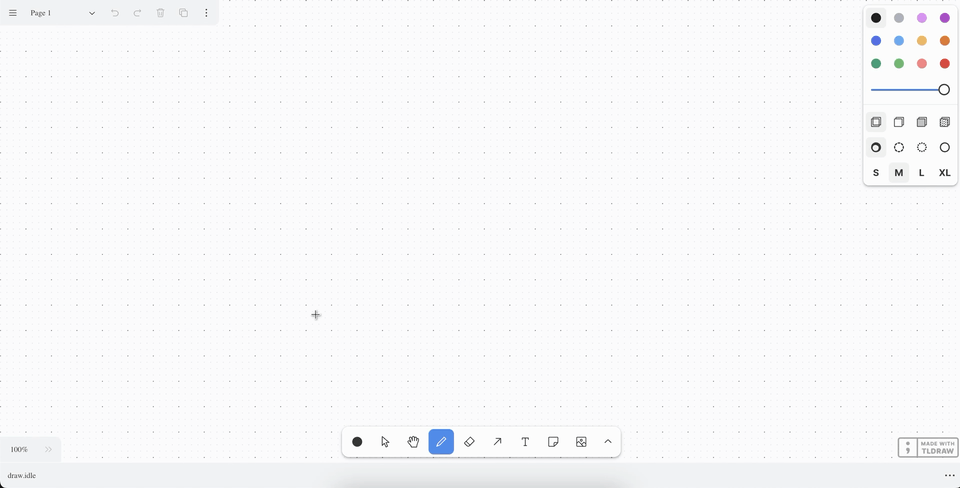

+++
date = '2024-12-22T15:23:25+08:00'
layout = 'post'
title = 'Tldraw Rider - Sled the Slopes Of Your Infinite Canvas'
image = './tldraw-rider.png'
+++

I work with tldraw for my day job. One day, when I was tasked with a myriad of
small bug fixes, I was looking at the tldraw canvas and I was reminded of a game
I used to play back in school,
[Line Rider](https://en.wikipedia.org/wiki/Line_Rider). The premise of the game
is that there's an entity on a sled and you have to draw lines for them to sled
on. So I thought, "Hey, tldraw is perfect for this" which is how this became my
weekend project this weekend.

The most up to date code can be found on the
[GitHub repo](https://github.com/robertcorponoi/tldraw-rider) for this project.

## Scoping

Since it's a weekend project, I had to scope it so that I wouldn't spend weeks
on it trying to make it into a full fledged game, even though it was really an
appealing thought. Maybe one day I'll come back to it and expand on it, or add
more features to it as another weekend project.

So the list of things I wanted:

-   A custom sprite for the rider.
-   Physics so that the rider slides across lines drawn with the "draw" and
    "line" tool.
-   Ability to place the rider anywhere and sleds goes from there.

## Choosing a Physics Engine

To have nice sledding physics, I wanted to use a physics engine. At first, I
looked at [matter.js](https://brm.io/matter-js/). It has comprehensive
documentation and a good amount of examples to go off of. But as I was looking
for alternatives, I came across [Rapier](https://rapier.rs/) and it immediately
caught my attention because it's a WebAssembly module. The performance
difference for a small project like this is basically non-existent but with the
possibility of an unknown number of lines with an unknown number of points, I
wanted to use the best tool for the job.

Also, I liked that Rapier is fully deterministic. Although there's a low chance
of me possibly clicking the exact same (x, y) coordinate on the tldraw canvas to
drop the rider in the same spot every time, it makes it possible to create a
replay feature in the future if I ever wanted to.

We can add Rapier by installing the package from
[npm](https://www.npmjs.com/package/@dimforge/rapier2d):

```shell
npm install @dimforge/rapier2d
```

**Note:** That we installed `rapier2d` not `rapier3d`.

## Creating the Sprite

For the sprite, I wanted to go with a pixel art style. I've always loved the
style of pixel art but I've never completed a piece of pixel art prior to this.
This time I was determiend though, tldraw rider needed a pixel art character
that you just might feel bad about when flipping them over or hitting a wall.

I won't go too much into the details. I recently purchased Aseprite so I started
with a 32x32 blank canvas (32x32 is the limit of my artistic abilities while
still having a good amount of detail). I started with the sled, using the Line
Rider sled as inspiration. Then, for the character, I thought I would get into
the holiday spirit and I chose to make a santa character. In the end, it ended
up looking like:



A more ambitious vision was having a reindeer pulling the sled with a joint
connecting the reindeer to santa but we'll keep it simple for now. I was pretty
proud of myself for my first completed pixel art sprite. It's also something I
really enjoyed making so I'll try more pixel art projects in the future.

**Note:** If you're reading this post around the time it was posted,
[tldraw.com](https://www.tldraw.com/) got into the holiday spirit and there's
snow over the canvas. I created the santa sprite before I noticed this but it's
a happy surprise, it really ties in well together.

## The Tldraw Rider Shape

I wanted to be able to have a tool on the toolbar that would select the rider
shape, and you could click anywhere on the canvas to place it. When the shape is
placed, we create the colliders on the spot. If another shape is placed, the
previous colliders and shape are destroyed and we create them again.

Creating a custom shape in tldraw is fairly simple, especially for a temporary
shape like this one where we don't have to worry about versioning and
migrations.

First, we have to define the type for our shape. There's nothing special about
it so it's just going to be based off the base shape with a width and a height.

```ts
type ITldrawRiderShape = TLBaseShape<
	"rider",
	{
		w: number;
		h: number;
	}
>;
```

While we're on the topic of dimensions, we have to decide how many pixels are in
a physics unit. The shapes on the canvas are going to be very large, dozens to
hundreds of pixels, and if we create colliders that large, our simulation is
going to run in
[slow motion](https://rapier.rs/docs/user_guides/javascript/common_mistakes#why-is-everything-moving-in-slow-motion).
To solve this, we need to define how many pixels to a physics unit. When going
from tldraw space to physics space, we need to divide by this unit and when
going from physics space to tldraw space we need to multiply by this unit. I
like to keep it simple so let's just say that 1 physics unit is equal to 100
pixels. So if we had a shape that's 100x100 pixels, it would be defined as a
collider with a size of 1x1.

```ts
const PHYSICS_UNIT_TO_PX = 100;
```

Okay let's get back to our shape. We have to create a class for it and define
some basic properties. I'm not paste the full class since a lot of it is just
boilerplate. The part to focus on is the `component`, which is what returns the
the React component for our shape. Currently it's just return a div with our
image in the center.

```tsx
export class TldrawRiderShapeUtil extends ShapeUtil<ITldrawRiderShape> {
	/**
	 * Custom shape boilerplate here.
	 *
	 * See https://tldraw.dev/examples/shapes/tools/custom-config for more details.
	 */

	/**
	 * The render method - the React component that will be rendered for the
	 * shape. It takes the shape as an argument. `HTMLContainer` is just a
	 * `div` that's being used to wrap our shape. We can get the shape's
	 * bounds usinig our own `getGeometry` method.
	 *
	 * The contents of this can be treated as a React component. Any hooks
	 * can be used here.
	 *
	 * @param {ITldrawRiderShape} shape The shape.
	 */
	component(shape: ITldrawRiderShape) {
		return (
			<HTMLContainer
				id={shape.id}
				style={{
					display: "flex",
					flexDirection: "column",
					alignItems: "center",
					justifyContent: "center",
					pointerEvents: "all",
				}}
			>
				
			</HTMLContainer>
		);
	}
}
```

At this point if you create a tool for it and add it to the toolbar
[shown in the tldraw example for a custom shape and tool](https://tldraw.dev/examples/shapes/tools/custom-config),
you can place our santa sprite on the tldraw canvas, exciting!

## The Physics World

Before we create any rigid bodies or colliders, let's set up our Rapier world
that will process our physics simulations.

Since Rapier is a WebAssembly module, it has to be
[loaded asynchronously](https://rapier.rs/docs/user_guides/javascript/getting_started_js).
We can do this in a `useEffect` in our `component`:

```ts
useEffect(() => {
	import("@dimforge/rapier2d").then((RAPIER) => {
		// We have access to rapier here.
	});
}, [shape.id]);
```

**Note:** I put `shape.id` in the dependencies list for the `useEffect` because
we'll need to reference the rider shape often. It should only be run once since
the shape id will not change after it is created.

From this point forward, I will specify whether we are adding code to the
physics context or outside of it.

One of the first things we have to do inside the physics context is set up our
world. The world contains everything we need to run the physics simulation. We
just have to initialize it with a gravity like so:

```ts
const gravity = {
	x: 0.0,
	y: 9.81,
};
const world = new RAPIER.World(gravity);
```

**Note:** `gravity` is defined as `9.81` instead of `-9.81` because the y axis
in tldraw increases as it goes down. If we had `y: -9.81` our rider would appear
to be defying gravity, which is cool but not for this project.

Before setting up the loop, let's get the full rider shape. Since we only added
`shape.id` to the `useEffect`'s dependencies, we need to get the shape by its
id.

**Note:** We only added `shape.id` to the `useEffect`'s dependencies so that we
don't add the entire shape to the dependencies. The more simple we can keep the
dependency array the better.

```ts
const riderShape = this.editor.getShape(shape.id) as ITldrawRiderShape;
if (!riderShape) return;
```

We cheat a little with TypeScript using `as ITldrawRiderShape` but that's okay
since we know exactly what this shape is.

After this, we need to set up our game loop. In here, every frame we step
through the physics simualation and we'll use the updated values to update the
position of our rider in the canvas. For now let's just set up the basic game
loop.

Below where we created the world, we add:

```ts
const gameLoop = () => {
	world.step();

	requestAnimationFrame(gameLoop);
};

if (riderShape) gameLoop();
```

In the game loop we call `world.step()` to process another frame of the physics
simulation. This will check collisions and recalculate transformations,
rotations, etc. on the rigid body that we'll attach to the rider.

We call `requestAnimationFrame` to run it in a loop and below we call `gameLoop`
to kick start the loop.

**Note:** We check if a `riderShape` is present before starting the game loop
because I've noticed that if I create a tool for this custom shape, the game
loop will run before the rider has been added to the canvas.

## Debug Lines

While adding the rigid body to the rider and adding colliders, it's very helpful
to see where they are positioned on the canvas, especially since we have to
convert between tldraw space and physics space. For this, Rapier provides the
ability to
[render debug shapes](https://rapier.rs/docs/user_guides/javascript/getting_started_js#rendering-debug-shapes).

The example shown in the link above is for Pixi.js so we'll have to adapt it
slightly to work for tldraw.

First, while Pixi.js has a function to convert an array of normalized RGB
values, `PIXI.utils.rgb2hex`, to a hex color value, we'll have to calculate that
ourselves. This is just a standard equation that we can find so let's just
define it as a utility function outside of our shape:

```ts
/**
 * Takes in an array of normalized RGB values (0–1) and returns a hexadecimal
 * color string.
 *
 * @param {[number,number,number]} normalizedRgb The normalized RGB values.
 *
 * @returns {string} The hexadecimal color string.
 */
export const rgbToHex = (normalizedRgb: [number, number, number]): string => {
	// Scale the normalized values to 0–255 and convert to integers.
	const scaledRgb = normalizedRgb.map((value) => Math.round(value * 255));

	// Format as a hexadecimal string.
	const hexColor = `#${scaledRgb
		.map((value) => value.toString(16).padStart(2, "0"))
		.join("")
		.toUpperCase()}`;

	return hexColor;
};
```

Also, while this returns a hex color value, tldraw expects colors to be one of
the colors defined by them, like red, blue, etc. Through trial and error I found
out the hex colors that Rapier uses for debug lines and I made an object to map
the hex color value to the tldraw color value. I tried to match the hex color
value as closely as possible but some colors were just too close together and
there's not enough variance in tldraw's colors.

```ts
const HEX_TO_TLDRAW_COLOR: { [hex: string]: string } = {
	"#800000": "red",
	"#003300": "green",
	"#990033": "violet",
	"#CC6600": "orange",
	"#1A0000": "yellow",
	"#1F000A": "grey",
	"#000A00": "black",
};
```

Before we get to writing the function, we need one last thing. Since debug lines
are just vertices and colors, we don't know what lines to keep and throw away
between steps of the game loop, which means that we have to run this function
every iteration of our loop. This isn't performant (like at all) but it's for
debugging so it's not a big deal. If we really wanted to optimize this we could
do some clever tricks to memoize debug lines but maybe another time. Anyway, I
say all this because we need a variable, defined outside of the shape and this
debug function, to keep track of the shape ids of the debug lines. Every frame
we're going to delete the lines in this array, clear the array, then redraw the
lines and add them to the array.

```ts
let debugLineIds: TLShapeId[] = [];
```

Ok we're finally ready to create the function to draw the debug lines. I'll
paste the entire function and we'll go through the parts.

```ts
const createDebugLines = (world: World, editor: Editor) => {
	try {
		debugLineIds.map((lineId) => editor.deleteShape(lineId));
		debugLineIds = [];

		const { vertices, colors } = world.debugRender();

		for (let i = 0; i < vertices.length / 4; i += 1) {
			const color = rgbToHex([
				colors[i * 8],
				colors[i * 8 + 1],
				colors[i * 8 + 2],
			]);

			const shapeColor = HEX_TO_TLDRAW_COLOR[color];
			if (!shapeColor) throw new Error(`Unknown color: ${color}`);

			const id = createShapeId();
			editor.createShape({
				id,
				type: "line",
				props: {
					color: shapeColor,
					points: [
						{
							id: `a${i}`,
							index: `a${i}`,
							x: vertices[i * 4] * PHYSICS_UNIT_TO_PX,
							y: vertices[i * 4 + 1] * PHYSICS_UNIT_TO_PX,
						},
						{
							id: `a${i}`,
							index: `a${i}`,
							x: vertices[i * 4 + 2] * PHYSICS_UNIT_TO_PX,
							y: vertices[i * 4 + 3] * PHYSICS_UNIT_TO_PX,
						},
					],
				},
				meta: {
					isDebugLine: true,
				},
			});

			debugLineIds = [...debugLineIds, id];
		}
	} catch (error) {
		console.error(`Error creating debug lines: ${error}`);
	}
};
```

1. As mentioned before, we want to delete all of the lines from the previous
   render and reset the debug line ids array to be empty:

```ts
debugLineIds.map((lineId) => editor.deleteShape(lineId));
debugLineIds = [];
```

2. Get the vertices and the colors to use for the lines from Rapier:

```ts
const { vertices, colors } = world.debugRender();
```

3. Next, we loop through each set of vertices (we divide the length 4 because
   each line consists of a start and end x and y).

First, we get the get color to use for the line by converting the value to the
hex color and then mapping it to our tldraw color.

Then, we create an id, outside of `createShape` so we can add it to our debug
line ids, and then create the shape using the vertices, mapped from physics
space to tldraw space. We also add a `meta` property, `isDebugLine: true`. So
that when we iterate through the shapes on the canvas, we know what's a Rapier
debug line and what's a line drawn by the us.

4. Add the ids of the lines created for the debug lines to our array so that
   next iteration we can delete them from the canvas.

Now, at the bottom of our `gameLoop` function, before the call to
`requestAnimationFrame(gameLoop)`, add:

```ts
createDebugLines(world, this.editor);
```

## Adding Physics to the Rider

Ok so now we have our rider shape, we have the physics world set up, and we can
render debug lines so we can see our rigid body and colliders. Let's attach a
rigid body and a collider to the rider.

First, we have to create a dynamic rigid body, so that the rider is affected by
physics, and move it to the position of where the shape is created:

```ts
const riderRigidBodyDesc = RAPIER.RigidBodyDesc.dynamic().setTranslation(
	riderShape.x / PHYSICS_UNIT_TO_PX,
	riderShape.y / PHYSICS_UNIT_TO_PX
);
const riderRigidBody = world.createRigidBody(riderRigidBodyDesc);
```

For the translation of the rigid body, we just set it to the position of the
rider shape, making sure to convert from tldraw space to physics space.

<!-- For the translation, we have to add half the width/height to the position because if we set it to just the rider's x and y, the rigid body is centered at the top left corner of the shape.  You can actually see this if you remove the addition of the half dimensionBy adding half the dimensions of the rider shape to it, we can have the rider shape and its rigid body in sync. Also, as mentioned before, we divide by `PHYSICS_UNIT_TO_PX` to convert from tldraw space to physics space. -->

Next is the collider for the rider. This one is a bit more hardcoded because we
want a rounded collider just around the sled. You could argue that the collider
should encompass santa but we want to avoid harm coming to our santa and also
the collider is more rounded just around the sled.

We're going to use a round cuboid collider so it'll be a rectangle around our
sled with the corners rounded:

```ts
const riderColliderDesc = RAPIER.ColliderDesc.roundCuboid(
	12 / PHYSICS_UNIT_TO_PX,
	1 / PHYSICS_UNIT_TO_PX,
	0.05
)
	.setTranslation(0, 0.1)
	.setFriction(0)
	.setFrictionCombineRule(RAPIER.CoefficientCombineRule.Min)
	.setRestitution(0);

const riderCollider = world.createCollider(riderColliderDesc, riderRigidBody);
```

I mentioned that the values here would not be pretty. I just fined tuned them
using the debug lines until I saw a collider I liked. We also set friction to 0
so that it slides like a well oiled sled and the restitution to 0 so that it
doesn't bounce off the lines.

Speaking of debug lines, if you place the rider on the canvas now, you should
see the debug lines for the collder appear.



There's actually an issue here though, the collider is not aligned with the
sprite. You'll notice that the center of the collider is aligned with the top
left of the sprite. The pivot of Rapier and tldraw is off. To fix this, we just
add half the dimensions of the sprite to the translation of the rigid body:

```ts
const riderRigidBodyDesc = RAPIER.RigidBodyDesc.dynamic().setTranslation(
	(riderShape.x + riderShape.props.w / 2) / PHYSICS_UNIT_TO_PX,
	(riderShape.y + riderShape.props.h / 2) / PHYSICS_UNIT_TO_PX
);
```

Now if you add the rider and look at the debug lines, it all lines up!



## Creating Colliders For Lines

Next, we need to add colliders to lines drawn by the user so that our santa has
something to sled on. We're going to support both drawn lines and lines created
with the line tool. To make it easier to handle these types of lines, and any
future lines, let's put this in a function outside of the shape. It'll take the
Rapier instance and the shape to create the collider for. If the shape is one we
support (draw, line) then we'll return the `ColliderDesc` for it. Otherwise,
we'll return `undefined` to indicate it's not supported.

```ts
const createColliderDescForShape = (
	RAPIER,
	shape: TLShape
): ColliderDesc | undefined => {
	switch (shape.type) {
		default:
			return;
	}
};
```

Let's trackle the draw shape type first. The draw shape consists of a series of
points that makes up the line. Luckily, Rapier has a `polyline` collider type
that we can use for this. We just pass it a series of points. If we were more
concerned about performance, we might try to use the heightfield but it would be
less of an accurate line since it would have sharp points instead of smooth
hills.

So the switch case for our draw shape looks like:

```ts
switch (shape.type) {
	case "draw": {
		const draw = shape as TLDrawShape;

		return RAPIER.ColliderDesc.polyline(
			new Float32Array(
				draw.props.segments[0].points.flatMap((point) => [
					(shape.x + point.x) / PHYSICS_UNIT_TO_PX,
					(shape.y + point.y) / PHYSICS_UNIT_TO_PX,
				])
			)
		)
			.setFriction(0.5)
			.setRestitution(1.0);
	}
}
```

**Note:** With both of these shapes, we have to add the position of the point to
the base position of the shape. The points on these lines start at (0, 0) at the
position of the shape.

First we cheat TypeScript a little bit again with `as TLDrawShape` since we know
it's a draw shape. This gives us the typing for the shape's props which is nice
to have with more complicated shapes.

Then, we create the `polyline` collider. The `polyline` collider expects a
`Float32Array` of x, y, x, y, etc. The draw shape has segments and search
segment has x, y points. In the code above, I just always use `segment[0]`. I've
personally not come across a situation where I had multiple segments. But since
each point in a segment is a `{ x: number; y: number }` object, and we just need
a flat array, we use `flatMap` to just return the x and y number values. Then,
we set friction to 0.5 so it acts like a ground terrain. You can tweak these
friction and restitution values to change the speed and bounciness of the rider.

For the line shape, it's even easier. We'll be using Rapier's segment collider
which just takes a start and end point and creates a straight line, matching the
line shape. It looks pretty similar to the draw shape from above but with just
the start and end points:

```ts
switch (shape.type) {
	case "line": {
		const line = shape as TLLineShape;

		const points = Object.keys(line.props.points).map(
			(key) => line.props.points[key]
		);

		return RAPIER.ColliderDesc.segment(
			new Vector2(
				(line.x + points[0].x) / PHYSICS_UNIT_TO_PX,
				(line.y + points[0].y) / PHYSICS_UNIT_TO_PX
			),
			new Vector2(
				(line.x + points[1].x) / PHYSICS_UNIT_TO_PX,
				(line.y + points[1].y) / PHYSICS_UNIT_TO_PX
			)
		)
			.setFriction(0)
			.setRestitution(0);
	}
}
```

The points on the line are defined as keys on an object with key names that
aren't directly related to their indices so we put them into an array to make it
easier. Again we add the points to the position of the shape and convert into
physics space. For smooth lines like this, we set friction and restitution to 0
so it acts as ice.

## Adding Colliders To Lines

Now that we can easily create colliders for shapes, we need to actually create
them when the rider shape is placed on the screen. The following code is in the
`useEffect` but outside of the game loop.

First though, let's keep track of the handles of the colliders that we're going
to add just like we did with the player collider. This makes it much easier to
reference them in the future. Unlike the rider though, we don't know the exact
shape id that the colliders are attached to so lets make it an object with the
keys being shape ids and the values being the handles of the colliders.

```ts
let shapeColliderHandles: {
	[shapeId: string]: number;
} = {};
```

Now we can get all of the shapes that have been drawn to the page:

```ts
const currentPageShapes = this.editor.getCurrentPageShapes();
```

**Note:** If I was optimizing this, I'd filter out culled shapes. I haven't
tried it but there's a function on the editor, `this.editor.getCulledShapes()`
and we should be able to use the results of this to filter out the page shapes
above.

Next, we'll go through each shape and attempt to create a shape for it. One of
our constraints though is that only one rider can be on the screen at one. This
is more performant, easier to debug and manage, and there's only one santa in
real life anyways. So while we're looping through the shapes to add colliders to
them, we're also going to see if we need to delete any old riders or not.

First, let's set up the loop:

```ts
let shapesToDelete: TLShapeId[] = [];

currentPageShapes.forEach((currentPageShape) => {});
```

We're going to add the shapes that should be deleted (which should just be old
rider shapes) to the `shapesToDelete` array. Let's tackle that part first.

```ts
if (currentPageShape.type === "rider") {
	if (currentPageShape.id === shape.id) {
		return;
	} else {
		shapesToDelete = [...shapesToDelete, currentPageShape.id];
	}
}
```

The first condition `currentPageShape.id === shape.id` checks if the rider shape
is the one that is newly created. If so, we don't want to do anything.
Otherwise, if there's a rider shape with any other id, return it so it can be
deleted.

Next, we're going to check if the shape is a debug line or not. If so, we don't
do anything. If we didn't have this check, we would create colliders for the
debug lines, which is very much not performant.

```ts
if (currentPageShape.meta.isDebugLine) {
	return;
}
```

Ok now we're at the point where the shape is not a rider and is not a debug line
so let's try to create a collider for it using the function we created in the
previous section.

```ts
const currentPageShapeColliderDesc = createColliderDescForShape(
	RAPIER,
	currentPageShape
);
```

Ok I've been saying "create a collider" but really we're just creating the
description of the collider. If you remember, this function either returns the
`ColliderDesc` if it's a shape we support, or it returns `undefined` otherwise.
So let's handle both cases.

If it returns a `ColliderDesc`, then we want to actually create the collider and
add it to the world, and our own object. Otherwise we'll just log a warning that
the shape is not supported.

```ts
if (currentPageShapeColliderDesc) {
	const currentPageShapeCollider = world.createCollider(
		currentPageShapeColliderDesc
	);

	shapeColliderHandles = {
		...shapeColliderHandles,
		[currentPageShape.id]: currentPageShapeCollider.handle,
	};
} else {
	console.warn(`Shape type ${currentPageShape.type} is not supported.`);
}
```

To wrap up this section, let's delete our shapes that were returned from the
loop.

```ts
shapesToDelete.forEach((shapeId) => {
	this.editor.deleteShape(shapeId);
});
```

At this point you should be able to draw a line or use the line tool to create a
line then add a rider to the canvas and you should see the debug lines for the
terrain. If your frames start dropping, don't worry about it too much. We won't
reliably be able to use these lines while actually playing the game since they
can drastically reduce frames. Instead, we just want to use them to debug the
positions of colliders on shapes and the rider but in limited context.



## Deleting Colliders When Shapes Are Deleted

I'll keep this section short, this is just in case the rider or one of the
terrain lines is deleted while the simulation is running. We remove any physics
entites on the shapes so clean up.

tldraw makes this easy with their side effects so we can create a side effect
that runs after a shape is deleted and depending on the shape, we can remove the
physics entities attached to it.

I'll go ahead and paste the whole block. This goes after the loop we created
above.

```ts
this.editor.sideEffects.registerAfterDeleteHandler("shape", (deletedShape) => {
	if (deletedShape.id === shape.id) {
		world.removeCollider(riderCollider, true);
		world.removeRigidBody(riderRigidBody);

		return;
	}

	if (deletedShape.meta.isDebugLine) {
		return;
	}

	if (deletedShape.id in shapeColliderHandles) {
		const shapeCollider = world.getCollider(
			shapeColliderHandles[deletedShape.id]
		);
		world.removeCollider(shapeCollider, false);
	}
});
```

Basically, if the deleted shape is the rider, we remove the collider and rigid
body, which we set to variables earlier. If the shape is a debug line we do
nothing since it's just a representation of a rigid body or collider and not one
itself, and if it's anything else we get the collider handle from our shape ->
collider handle mapping and delete it.

## Moving the Rider

Now that we've set up our physics world, we can finally move the rider based on
the physics simulation.

In the game loop, after `world.step()`, we need to get our rider shape again so
that we have access to its properties.

```ts
const rider = this.editor.getShape(shape.id) as ITldrawRiderShape;
if (!rider) return;
```

Then, get the rigid body's latest position after stepping the physics simulation
forward one frame.

```ts
const position = riderRigidBody.translation();
```

Next, we calculate the next position of the rider shape from this. We calculate
this by taking the new position of the rigid body, adjusting for the difference
in anchor points, and again converting from physics space to tldraw space.

```ts
const nextPosition = new Vector2(
	(position.x - rider.props.w / 2 / PHYSICS_UNIT_TO_PX) * PHYSICS_UNIT_TO_PX,
	(position.y - rider.props.h / 2 / PHYSICS_UNIT_TO_PX) * PHYSICS_UNIT_TO_PX
);
```

**Note:** Since this position will be applied to our rider shape, `Vector2` is
an import from tldraw.

Let's apply this update to our shape.

```ts
this.editor.updateShape({
	id: shape.id,
	type: "rider",
	x: nextPosition.x,
	y: nextPosition.y,
});
```

Now we have basic physics working on the rider. If you create a line, and then
place the rider above it, you should see the rider falling down due to gravity
and then it skiing on the line. You'll notice though that the rider doesn't
rotate to match the slope of the line, it just stays flat while skiing down.
Let's fix this.

## Rotating the Rider

We can get the rotation of the rider's rigid body with:

```ts
const newRotation = riderRigidBody.rotation();
```

Now, if you apply this to the `updateShape` we added above like:

```ts
this.editor.updateShape({
	id: shape.id,
	type: "rider",
	x: nextPosition.x,
	y: nextPosition.y,
	rotation: newRotation,
});
```

and run the simulation, you might notice that it looks...bad. This is because if
you rotate the shape like this, it rotates it based on the top left point of the
shape, which is not what we expect. We want to rotate around the center point of
the shape.



We can''t do this in `updateShape` so if you added the rotation above, remove it
now. Instead, tldraw has a `editor.rotateShapesBy` method that can be used to
rotate shapes around any center point, defaulting to the center point of the
shapes passed to it. If we just pass in our rider shape, it'll rotate around the
center point of the rider shape. As for parameters, it takes an array of shape
ids to rotate (which we'll just pass in our rider shape by) and the amount to
rotate by in radians.

`riderRigidBody.rotation();` returns us the current rotation, not the
difference, but we can get the difference by subtracting the current rotation
from it:

```ts
const rotationDiff = newRotation - rider.rotation;
```

Luckily, this is already in radians so we can just pass it to `rotateShapesBy`:

```ts
this.editor.rotateShapesBy([shape.id], rotationDiff);
```

If you look at the simulation now, it might almost seem correct. There's still
one last rotation issue, the x and y position of the rider shape changes as it
rotates because the position is based on the top left corner of the rider shape.
This top left corner changes positions as it rotates. To really see the issue,
set the gravity of the world to 0 and add a small torque impulse to the rigid
body just outside of the game loop to make it rotate on the spot.

```ts
riderRigidBody.applyTorqueImpulse(0.0001, true);
```

This will cause the rigid body to start spinning and with debug lines on you can
see the rider shape getting out of sync with the collider. To fix this, we need
another utility function that calculates the coordinates of the rotated top left
corner of the shape around its center.

As input, we'll need the center position of the shape, the dimensions of the
shape, and the rotation of the shape in radians.

```ts
export const getRotatedTopLeftForRectangle = (
	cx: number,
	cy: number,
	width: number,
	height: number,
	angle: number
): { x: number; y: number } => {};
```

**Note:** As the name implies, this can be used for any rectangular shape.

First, we get the half width and height based on the dimensions passed in and
use it to determine the position of the top left point of the shape.

```ts
const halfWidth = width / 2;
const halfHeight = height / 2;

const dx = -halfWidth;
const dy = -halfHeight;
```

Next, we apply the rotation matrix to the offsets.

```ts
const dxRot = dx * Math.cos(angle) - dy * Math.sin(angle);
const dyRot = dx * Math.sin(angle) + dy * Math.cos(angle);
```

-   `dxRot` represents the x-coordinate offset after rotating.
-   `dx * Math.cos(angle)` projects the horizontal offset `dx` onto the rotated
    x-axis.
-   `-dy * Math.sin(angle)` projects the vertical offset `dy` onto the rotated
    x-axis, with the sign changed because the y-axis rotates counterclockwise.

-   `dyRot` represents the y-coordinate offset after rotating.
-   `dx * Math.sin(angle)` projects the horizontal offset `dx` onto the rotated
    y-axis.
-   `dy * Math.cos(angle)` projects the vertical offset `dy` onto the rotated
    y-axis.

This part just calculates how the top left corner of the shape shifts due to the
rotation of the shape.

```ts
const x = cx + dxRot;
const y = cy + dyRot;

return { x, y };
```

Lastly, we add the rotated offsets to the center position of the shape to
compute the new absolute position of the top left corner of the shape and return
it.

Now let's use this in our rotation.

After calculating `nextPosition`, lets calculate the `rotatedTopLeftPosition`:

```ts
const rotatedTopLeftPosition = getRotatedTopLeftForRectangle(
	nextPosition.x + rider.props.w / 2,
	nextPosition.y + rider.props.h / 2,
	rider.props.w,
	rider.props.h,
	rider.rotation
);
```

Now when updating the shape with `this.editor.updateShape`, for the x and y
values, use `rotatedTopLeftPosition.x` and `rotatedTopLeftPosition.y` instead of
`nextPosition.x` and `nextPosition.y` like:

```ts
this.editor.updateShape({
	id: shape.id,
	type: "rider",
	x: rotatedTopLeftPosition.x,
	y: rotatedTopLeftPosition.y,
});
```

Now if you look at your spinning santa, the shape and collider should be in
sync. If you add the gravity back in and remove the torque impulse, you should
see your rider correctly rotating to match the slope of the line.



There's also currently an
[open issue in the tldraw GitHub repo](https://github.com/tldraw/tldraw/issues/5134)
where a selected shape that's continuously rotating causes a drop in frames per
second. To remedy this, add this line outside of the game loop where we get the
rider shape by its id.

```ts
this.editor.deselect(shape.id);
```

## Let's Test It Out

That's it for now, let's see what we've come up with!



Wow that was a sick flip.

## Next Steps

If I wanted to continue with this, some other ideas I would pursue would be:

-   Have the camera follow the rider.
-   Don't create colliders for culled shapes. Create the colliders for shapes as
    they come into view.
-   Create colliders for other tldraw shape types such as geo, arrows, etc. with
    different physics properties.
-   A reindeer pulling the sled with a joint attached to the sled.
-   Improve the collider for the rider. Currently the collider is just around
    the sled and not santa.
-   Particle effects for fun.
-   Add the ability to place checkpoints or a finish line.
